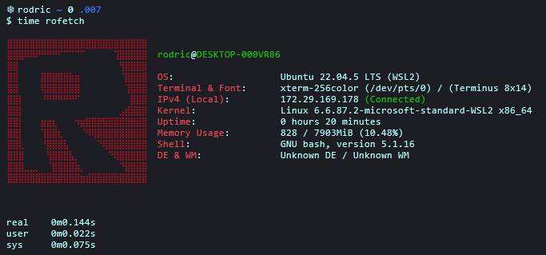
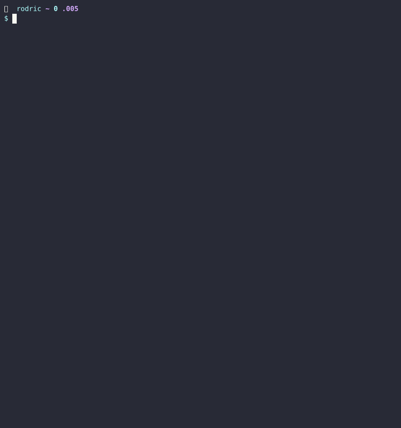
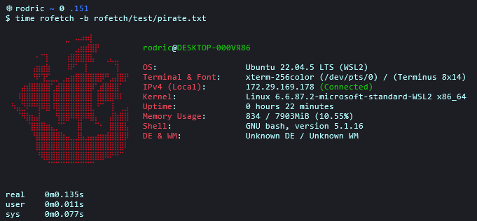

<h1 align="center">rofetch</h2>

<p align="center">
  
</p>

**rofetch, is my home-made GNU/Linux system fetching program which was inspired by neofetch.**
**rofetch was only tested on Debian (bookworm) based distributions and Microsoft Windows Subsystem for Linux (WSL2) running Ubuntu 22.x LTS**

<hr>

## Example: <br>

<p align="center">
  
</p>

## Instalation & Execution <br>

> [!IMPORTANT] 
> Requirements: <br>

> **net-tools, iproute2, curl and jq** (sudo apt install net-tools iproute2 curl jq -y) <br>

```console
# Instalation:
$ git clone https://github.com/RodricBr/rofetch
$ cd rofetch/;chmod u+x rofetch
$ sudo mv rofetch /usr/local/bin/ # OR ANY OTHER DIRECTORY

# Execution:
$ rofetch -h
```

Or do a test run...

```console
echo -e "$(source <(curl -sk "https://raw.githubusercontent.com/RodricBr/rofetch/refs/heads/main/rofetch"))"
```

## Set custom ascii banner: <br>

```console
$ rofetch -b banner.txt
```

<p align="center">
  
</p>

> It is recommended for the ASCII banner to have about 13 lines (the rest will be cut off), and to add some <br>
> additional spaces/tabs to correctly align the informations outputted by the program.
