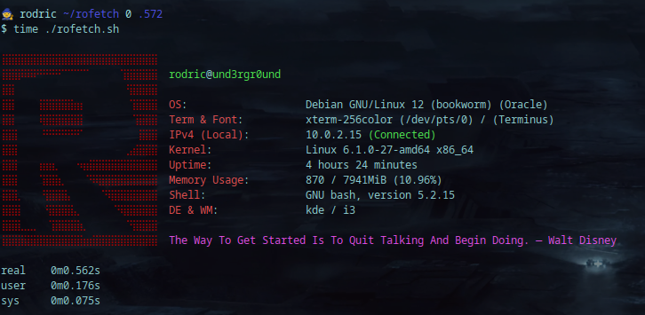
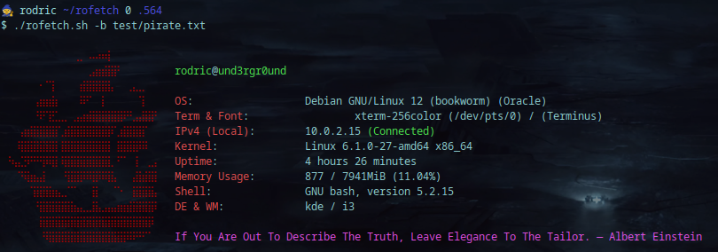

<h1 align="center">rofetch</h2>

<p align="center">
  
</p>

**rofetch, is my home-made GNU/Linux system fetching program which was inspired by neofetch but with an addition of random motivational quotes for you!**
**rofetch is only supported and was only tested on Debian (bookworm) based distributions and Microsoft Windows Subsystem for Linux (WSL2)**

<hr>

## Instalation & Execution <br>

> [!IMPORTANT] 
> Requirements: <br>

> **net-tools, curl and jq** (sudo apt install net-tools curl jq -y) <br>

```console
# Instalation:
$ git clone https://github.com/RodricBr/rofetch
$ cd rofetch/;chmod u+x rofetch
$ sudo mv rofetch /usr/local/bin/ # OR ANY OTHER DIRECTORY

# Execution:
$ rofetch -h
```

## Set custom ascii banner: <br>

```console
$ rofetch -b banner.txt
```

<p align="center">
  
</p>

> It is recommended for the ASCII banner to have about 13 lines (the rest will be cut off), and to add some <br>
> additional spaces/tabs to correctly align the informations outputted by the program.
