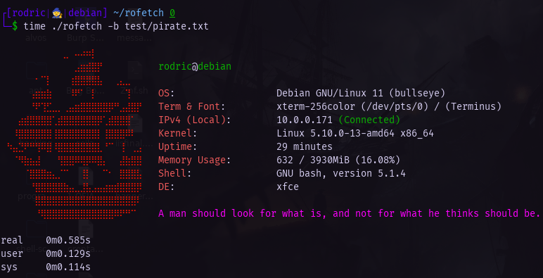

<h1 align="center">roFetch</h2>

<p align="center">
  
</p>

**rofetch (Rodric Fetch), is my home-made GNU/Linux system fetching program. With an addition of random motivational texts for you!**
**rofetch is only supported and was only tested on Debian based distributions**

<hr>

## Instalation & Execution <br>

> Required: <br>

> net-tools (sudo apt-get install net-tools) <br>
> [curl](https://curl.se/docs/install.html) <br>
> [jq](https://stedolan.github.io/jq/download/) <br>

```bash
git clone https://github.com/RodricBr/rofetch
cd rofetch/;chmod +x rofetch
sudo mv rofetch /usr/local/bin/
rofetch
```

## Set custom ascii banner: <br>

```console
$ rofetch -b banner.txt
```

<p align="center">
  
</p>

> If banner not specified, "**r.txt**", which is the default banner, will be set as default. <br>
> It is also recommended for the ASCII banner to have about 13 (the rest will be cut off), and to add some <br>
> additional spaces/tabs to correctly align the informations given by the program (inside vim, for example, use **:set list** to view invisible characters).
