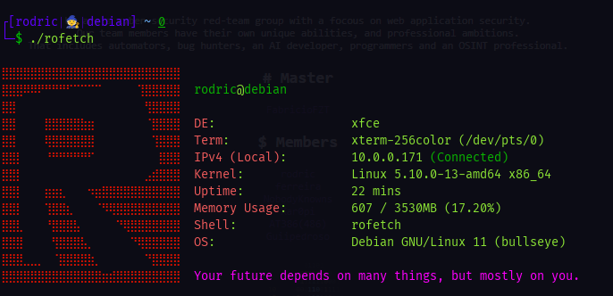

<h1 align="center">roFetch</h2>

<p align="center">
  
</p>

**roFetch (Rodric Fetch), my home-made GNU/Linux system fetching program. With an addition of random motivational texts for you!**

<hr>

## Instalation & Execution <br>

> Required: <br>

> net-tools (sudo apt-get install net-tools) <br>
> [curl](https://curl.se/docs/install.html) <br>
> [jq](https://stedolan.github.io/jq/download/) <br>

```bash
git clone https://github.com/RodricBr/rofetch
cd rofetch/;chmod +x rofetch
sudo mv rofetch /usr/local/bin/
rofetch
```
